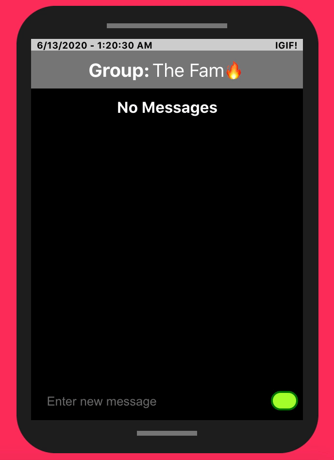
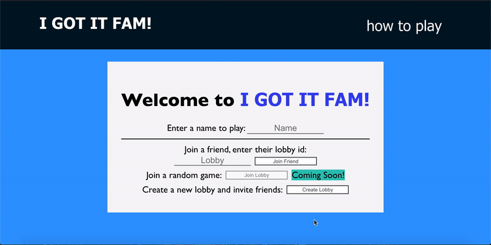
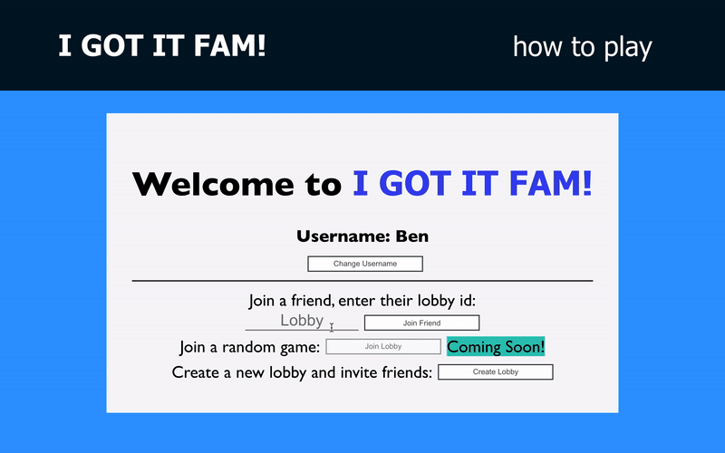
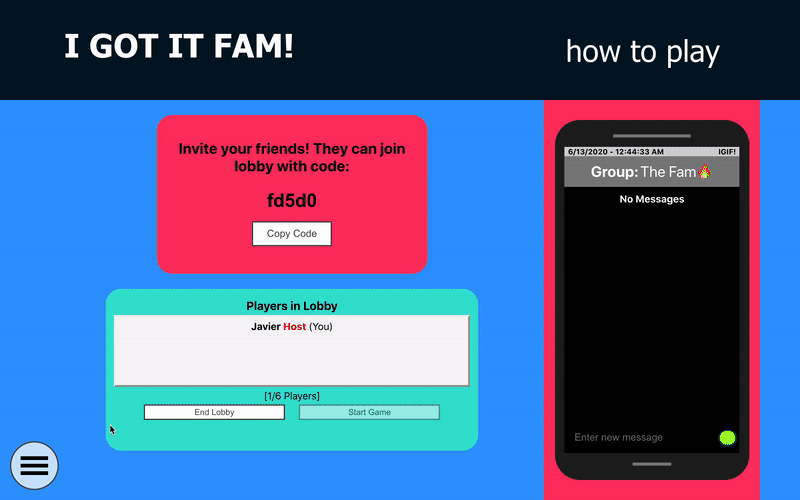
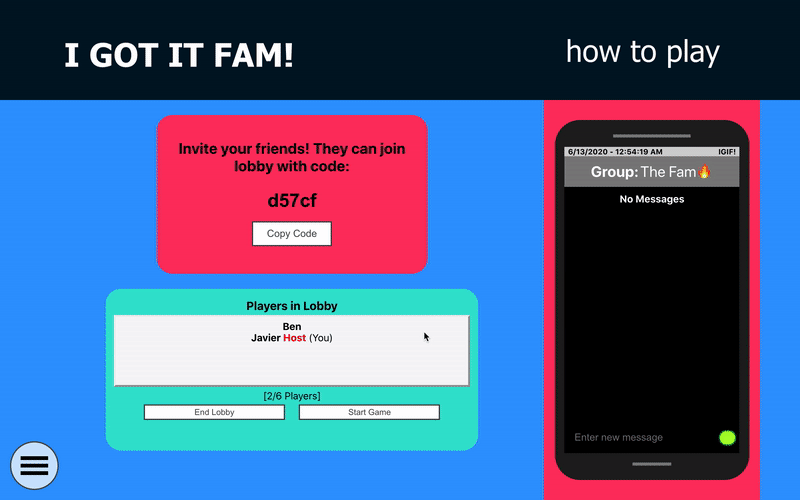

## I GOT IT FAM (Real-time Multiplayer Board Game)

[Link to Site](https://igotitfam.com/)

### Description: 
I GOT IT FAM is inspired by the classic board game Scattergories. Invite your friends
to play this real-time creative-thinking game. The objective of the game is to get the most
points by coming up with a word or term that fits the round's randomly generated category and
letter combination. Only the first answer is accepted so think fast!

### Features: 

    
Real-time chat available at all times.

    

 
 

    

        No need to sign up to play. Just use any username to go by
        and the application generates a unique userId and is saved
        as a cookie.
    

    

 
 

    

        Front-End is built with React.js framework.
    

    

 
 

    

        Back-End is built with Google Firebase tools: Google Real-time Database & Google Cloud Functions.
    

    

### How To Play: 

    

        Create a lobby or join a friend's lobby.
    

    

 
 

    

        Share lobby code to have friends join.
    

    

 
 

    

        The host can update the game settings before starting the game.
    

    

 
 

    

        On game start, rounds will start loading. After initial countdown, a random category
        and letter will appear.
    

    

 
 

    

        The first answer submitted by any player will be voted on by other players to see if
        point will be awarded. If majority votes yes, point awarded.
    

 
 

    

        If you are unable to come up with anything, click the 'Give Up' button. Point will be
        awarded to the first to 'Give Up' when no one submits answer for the given Category and Letter.
    

### Features Initial Release: 
- Real-time gameplay
- Real-time lobby
    -Invite Friends
- Real-time chat box at all times

### Future Updates:
- Join random lobby/game

