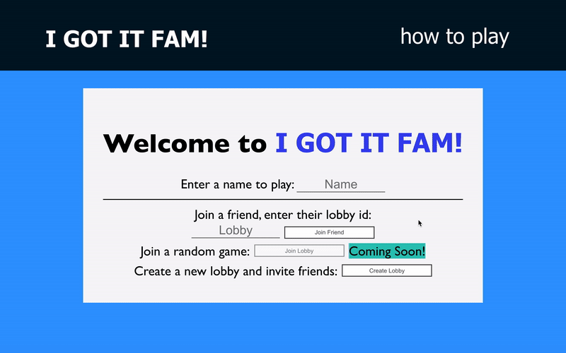

## I GOT IT FAM (Real-time Multiplayer Board Game)

[Link to Site](https://igotitfam.com/)

### Description: 
I GOT IT FAM is inspired by the classic board game Scattergories. Invite your friends
to play this real-time creative-thinking game. The objective of the game is to get the most
points by coming up with a word or term that fits the round's randomly generated category and
letter combination. Only the first answer is accepted so think fast!

### Features: 

    

    Real-time chat available at all times.
    
    

    

    
        No need to sign up to play. Just use any username to go by
        and the application generates a unique userId and is saved
        as a cookie.
    
    
    

    

    Front-End is built with React.js framework.
    
    

    

   Back-End is built with Google Firebase tools: Google Real-time Database & Google Cloud Functions.
    
    

### Features Initial Release: 
- Real-time gameplay
- Real-time lobby
    -Invite Friends
- Real-time chat box at all times

### Future Updates:
- Join random lobby/game

